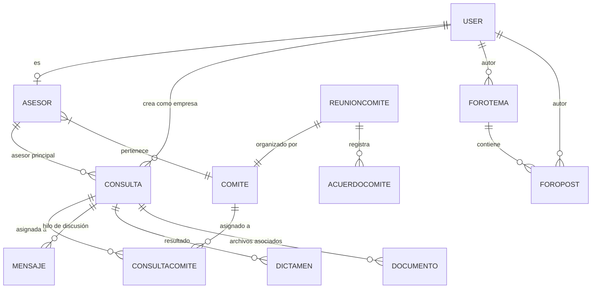

# Arquitectura de la Aplicación - Mesa Técnica de Criptoactivos

Este documento detalla la arquitectura técnica, el modelo de datos y la estructura de componentes de la plataforma de la Mesa Técnica de CAVECOM-e.

## 🚀 Stack Tecnológico

La aplicación está construida sobre un stack moderno y unificado:

- **Frontend & Backend**: [Next.js 15+](https://nextjs.org/) utilizando el **App Router**.
- **Lenguaje**: [TypeScript](https://www.typescriptlang.org/) para tipado estático y seguridad en el desarrollo.
- **Base de Datos**: [SQLite](https://sqlite.org/index.html) para portabilidad y simplicidad en entornos restringidos.
- **ORM**: [Prisma](https://www.prisma.io/) para la gestión de modelos y consultas a la base de datos.
- **Estilo**: [Tailwind CSS 4](https://tailwindcss.com/) con el plugin `@tailwindcss/postcss`.
- **UI Components**: [Shadcn/UI](https://ui.shadcn.com/) basado en Radix UI.
- **Gestión de Estado**: [Zustand](https://github.com/pmndrs/zustand) para el estado del lado cliente.
- **Notificaciones**: [Nodemailer](https://nodemailer.com/) para el envío de correos electrónicos.
- **IA**: Modelos de lenguaje integrados vía API para el asistente **Criptobot**.

## 🏗️ Estructura del Proyecto

```text
src/
├── app/
│   ├── api/             # Endpoints del Backend (Route Handlers)
│   │   ├── ai/          # Lógica del asistente Criptobot
│   │   ├── foro/        # Gestión de temas y posts
│   │   ├── consultas/   # CRUD y estados de consultas
│   │   └── ...          # Otras APIs (usuarios, asesores, comités)
│   ├── layout.tsx       # Estructura base, fuentes y proveedores
│   ├── page.tsx         # Punto de entrada de la SPA (Dashboard/App)
│   └── globals.css      # Estilos globales y tokens de Tailwind
├── components/
│   ├── ui/              # Componentes base (Botones, Inputs, Cards)
│   ├── mesa-tecnica-app.tsx  # Orquestador principal de la interfaz
│   ├── foro-module.tsx  # Módulo independiente del Foro
│   └── criptobot.tsx    # Interfaz del Asistente IA
├── lib/
│   ├── db.ts            # Singleton del cliente Prisma
│   ├── mail.ts          # Configuración y envío de correos
│   └── utils.ts         # Funciones de utilidad (cn, formateo)
└── types/               # Definiciones de interfaces TypeScript
```

## 📊 Modelo de Datos (Prisma)

El sistema utiliza un modelo relacional robusto para gestionar el flujo de trabajo de las consultas técnicas.



## 🔐 Sistema de Roles

El acceso está restringido mediante roles definidos en el enum `RolUsuario`:

1.  **ADMIN**: Control total, gestión de usuarios, configuración del sistema.
2.  **SECRETARIA_TECNICA**: Gestión del pipeline de consultas, asignación de comités y seguimiento de SLAs.
3.  **ASESOR**: Visualización de consultas asignadas, participación en debates y emisión de dictámenes.
4.  **EMPRESA_AFILIADA**: Envío de consultas, seguimiento de estatus y descarga de certificados/dictámenes.

## 🛠️ Flujo de Trabajo Principal (Consultas)

1.  **Recepción**: La empresa envía una consulta técnica.
2.  **Clasificación**: La Secretaría Técnica revisa y categoriza la consulta.
3.  **Asignación**: Se asigna a uno o más Comités Especializados y un Asesor Principal.
4.  **Procesamiento**: Debate interno en el foro/comité y solicitud de información adicional.
5.  **Dictamen**: El asesor emite el documento final con los fundamentos técnicos/legales.
6.  **Cierre**: La consulta se marca como cerrada y se notifica a la empresa.

## 🤖 Criptobot (Asistente IA)

El asistente reside en uno de los Floating Action Buttons de la aplicación principal. 
- **Contexto**: Tiene acceso (vía API) a datos agregados de comités, estatus de consultas (con código) y temas del foro.
- **Arquitectura**: Utiliza un Route Handler que procesa intents técnicos para responder de manera precisa sobre el estado del sistema.

## ✉️ Sistema de Notificaciones

Utiliza **Nodemailer** para enviar correos transaccionales críticos:
- Notificación de nuevas postulaciones de asesores.
- Notificación de aprobación/rechazo de candidatos.
- (Próximamente) Alertas de vencimiento de SLA.

## 📦 Despliegue

La aplicación está preparada para ser ejecutada en un entorno de servidor con **Node.js** o mediante un contenedor Docker. 
- La base de datos SQLite se almacena en el directorio `db/` por defecto.
- El build de Next.js genera un directorio `.next/standalone` para despliegues eficientes con bajo consumo de recursos.
