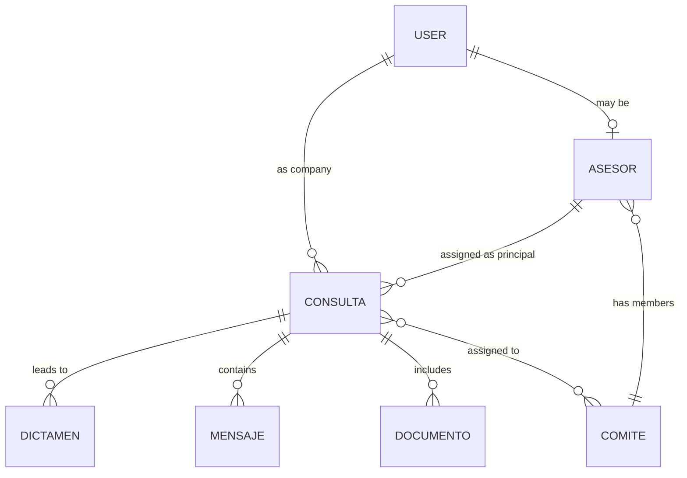

# Data Model Analysis - Mesa Técnica de Criptoactivos

## Core Entities

The application revolves around the lifecycle of a technical consultation.

### User & Roles
- **Model**: `User`
- **Roles (`RolUsuario`)**:
    - `ADMIN`: Full system management.
    - `SECRETARIA_TECNICA`: Operational management, classification, and assignment of consultations.
    - `ASESOR`: Technical experts who provide opinions (`Dictamenes`).
    - `EMPRESA_AFILIADA`: External entities that submit consultations.

### Consultation Lifecycle
- **Model**: `Consulta`
- **States (`EstadoConsulta`)**:
    - `RECIBIDA` -> `CLASIFICADA` -> `ASIGNADA` -> `EN_PROCESO` -> `DICTAMEN` -> `CERRADA`
- **Priorities (`PrioridadConsulta`)**: `BAJA`, `MEDIA`, `ALTA`, `URGENTE`.
- **Types (`TipoConsulta`)**: `LEGAL`, `FISCAL`, `TECNICA`, `MIXTA`.

### Knowledge & Opinions
- **Model**: `Dictamen`: The official response to a consultation.
- **Model**: `ArticuloKB`: Knowledge base articles generated from technical opinions.
- **Model**: `PlantillaDictamen`: Standardized templates for technical responses.

## Entity-Relationship Diagram (Conceptual)

## Key Modules Supported by Data

| Model | Purpose |
|-------|---------|
| `CandidatoAsesor` | Manages the onboarding funnel for new technical advisors. |
| `EventoAgenda` | Internal calendar for meetings, hearings, and deadlines. |
| `EncuestaSatisfaccion` | Feedback loop from companies regarding technical responses. |
| `Normativa` | Database of applicable laws and regulations. |
| `Capacitacion` | Educational material for advisors and members. |
